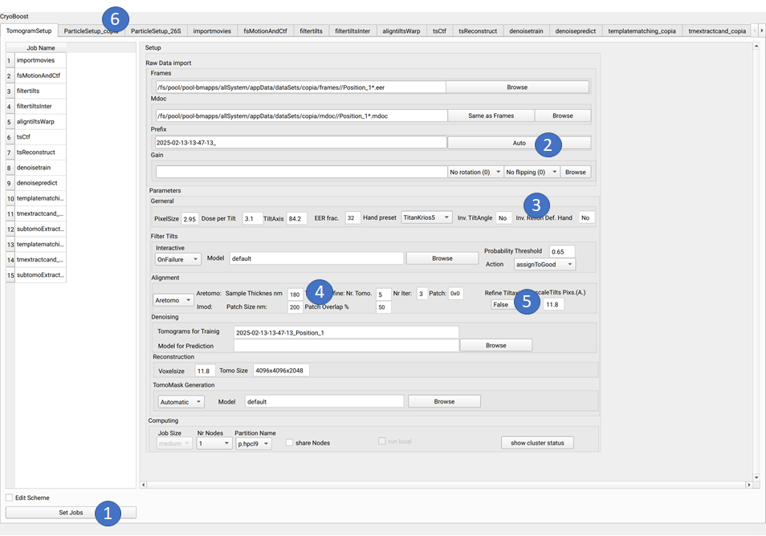
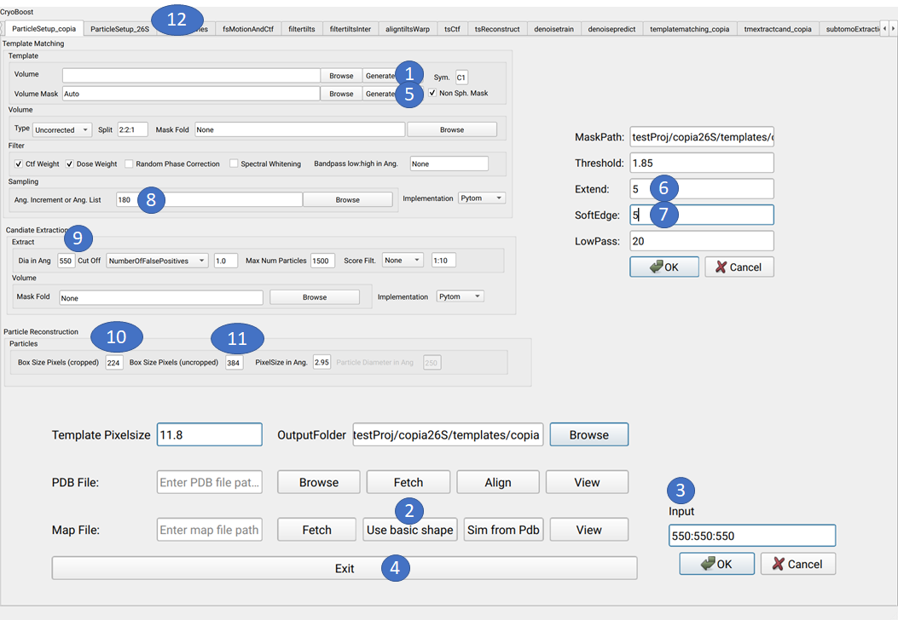
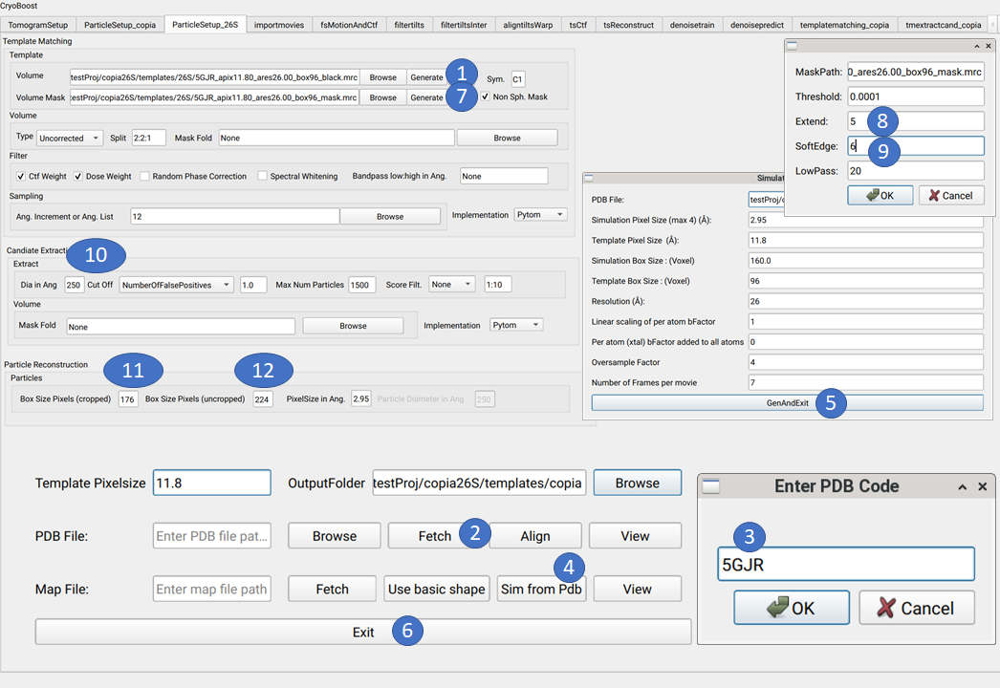
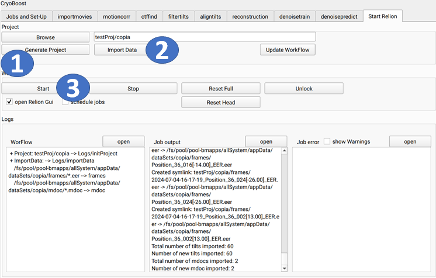

=========
Tutorial
=========

Open CryoBoost
=================

.. code-block:: bash

   module load CRYOBOOST
   # or
   source /path/to/my/Folder/CryoBoost/.cbenv
   crboost_pipe.py -mov '/fs/pool/pool-bmapps/allSystem/appData/dataSets/copia/frames//Position_1*.eer' -m '/fs/pool/pool-bmapps/allSystem/appData/dataSets/copia/mdoc//Position_1*.mdoc' --proj testProj/copia26S --scheme "warp_tomo_prep" --species "copia,26S"
   
   #or without arguments
   crboost_pipe.py 

Adapt Tomogram Parameters
======================

#. Click on Set Jobs to create the Job tabs.

#. Click on Auto to create a prefix.

#. Set Invert Tiltangel to No and Invert Defocus Hand to Yes.

#. Alignment: Set sample thickness to 180nm

#. Alignment: Switch off tiltaxis refinement (only 1 tomo)

#. Move to ParticleSetup_copia tap.

Adapt Copia Particle Parameters
================================

#. Click on Generate(Volume) to create a template

#. Click on Use Basic shape to create a sphere as template

#. Enter 3x the diamter (of copia) 550:550:550 and OK

#. Click exit

#. Click Generate(Mask) to create a Mask

#. Enter 5 for Extend and SoftEdge (Relion Mask parameters) and OK

#. Enter 90 as angular increment and

#. Enter 550 as diamter for peak extraction (avoid mult. extraction)

#. Enter 224 cropped (used) box size in pixels

#. Enter 384 uncropped box size in pixels

#. Move to ParticleSetup_26S tap.

Adapt 26S Particle Parameters
==============================

#. Click on Generate(Volume) to create a template

#. Click on Fetch Pdb to download pdb from pdb www.rcsb.org

#. Enter 5GJR and click OK

#. Click Sim from Pdb to simulate em density from pdb with cistem's simulate

#. Click Gen And Exit to start the simulation

#. Click Exit

#. Click Generate(Mask) to create a Mask

#. Enter 5 for Extend  (Relion Mask parameters) 

#. Enter 6 for SoftEdge (Relion Mask parameters) and OK

#. Enter 12 to set Angular Increment

#. Enter 250 as diameter for peak extraction (half 26S diameter rod shape)

#. Enter 1600 Max Num of particles

#. Enter 5 for Number of faslse positives

#. Enter 208 uncropped box size in pixels

#. Move to Start Relion tap.

Start WorkFlow
===============

#. Click on Generate Project.

#. Click on Import Data.

#. Click on Start.

Check Results
=============

Processing Copia
================

click on open Relion 

++++++++++++++++++++++
Reconstruct Particle
++++++++++++++++++++++

.. code-block:: bash
   
   Input Optimisation Set Extract/job12/optimisation_set.star
   
   Symmetry: I1
   Pre-read all particles into RAM: yes
   Box size: 384
   Cropped Box size: 224
   Submit to queue: yes
   Threads: 24

++++++++++++++++++++++
Class3d
++++++++++++++++++++++

.. code-block:: bash
   
   Input: Optimisation Set Extract/job12/optimisation_set.star
   RefereceMap: Reconstruct/job016/merged.mrc
   Inital Lowpass Filter (A): 45
   Symmetry: I1
   Number of Iterations: 15
  
   Mask Diameter: 575
   Pre-read all particles into RAM: yes
   Use GPU acceleration: yes
   Submit to queue: yes

++++++++++++++
Mask creation
++++++++++++++

.. code-block:: bash
   
   #Remove unstructured inner part
   cd myProjct
   module load EMAN
   e2proc3d.py Class3D/job017/run_it015_class001.mrc Class3D/job017/vol4Mask.mrc --process=mask.sharp:inner_radius=73
   Input 3d Map: Class3D/job017/vol4Mask.mrc 
   Lowpass: 18
   Inital binarisation threshold: 0.15
   Extend binary Map this many pixels: 5
   Add soft-edge of this many pixels: 7
   

+++++++++
Refine3d
+++++++++

.. code-block:: bash
   
   Input Optimisation Set Extract/job012/optimisation_set.star
   Reference Map:  Class3D/job017/run_it015_class001.mrc
   Reference Mask: MaskCreate/job018/mask.mrc 
   Mask Diameter: 575
   Initial Lowpass Filter: 40
   Symmetry: I1
   Use Flattern Solvent CTF: yes
   Pre-read all particles into RAM: yes
   Use GPU acceleration: yes
   Submit to queue: yes
   

++++++++++++++
Reconstruct
++++++++++++++

.. code-block:: bash
   
   Input Optimisation Set Refine3d/job019/optimisation_set.star
   
   Symmetry: I1
   Pre-read all particles into RAM: yes
   Box size: 384
   Cropped Box size: 224
   Submit to queue: yes
   Threads: 24   

++++++++++++++++++
PostProcessing
++++++++++++++++++

.. code-block:: bash
   
   Reference Mask: MaskCreate/job018/mask.mrc 
   Unfiltered Map: Reconstruct/job20/half1.mrc
   

+++++++++++++++++
Bayesian Polish
+++++++++++++++++

.. code-block:: bash
   
   Input Optimisation Set: Refine3d/job019/optimisation_set.star
   Reference Half Maps:  Reconstruct/job020/half1.mrc   
   Referece Mask: MaskCreate/job018/mask.mrc   
   Input PostProcess star: PostProcess/job021/post_process.star 
   Box Size: 256
   Max Position_error: 7
   Fit Per Particle Motion: yes
   Number of Threads: 24
   Submit to queue: yes

+++++++++++++++
Extract 
+++++++++++++++

.. code-block:: bash
   
   Input Optimisation Set: Polish/job022/optimisation_set.star
   Box Size: 384
   Cropped Box Size: 224   
   Threads: 24

++++++++++++++
Reconstruct
++++++++++++++

.. code-block:: bash
   
   Input Optimisation Set Extract/job023/optimisation_set.star
   Symmetry: I1
   Pre-read all particles into RAM: yes
   Box size: 384
   Cropped Box size: 224
   Submit to queue: yes
   Threads: 24   

++++++++++++++++
PostProcessing
++++++++++++++++

.. code-block:: bash
   
   Unfiltered Map: Reconstruct/job025/half1.mrc   
   Reference Mask: MaskCreate/job018/mask.mrc 

+++++++++++++++
CTF Refinement
+++++++++++++++

.. code-block:: bash
   
   Input Optimisation Set: Extract/job023/optimisation_set.star
   Reference Half Maps:  Reconstruct/job024/half1.mrc 
   Reference Mask: MaskCreate/job018/mask.mrc 
   Input PostProcess star: PostProcess/job26/post_process.star 
   Defocus Search Range: 6000
   Defocus Regularisation Lamda: 0.2

++++++++++++++++++
Reconstruct
++++++++++++++++++

.. code-block:: bash
   
   Input Optimisation Set CtfRefine/job026/optimisation_set.star
   
   Symmetry: I1
   Pre-read all particles into RAM: yes
   Box size: 384
   Cropped Box size: 224
   Submit to queue: yes
   Threads: 24      

++++++++++++++++
PostProcessing
++++++++++++++++

.. code-block:: bash
   
   Unfiltered Map: Reconstruct/job027/half1.mrc   
   Reference Mask: MaskCreate/job018/mask.mrc 

Processing 26S
================

++++++++++++++++++++++
Reconstruct Particle
++++++++++++++++++++++

.. code-block:: bash
   
   Input Optimisation Set Extract/job015/optimisation_set.star
   
   Symmetry: C2
   Pre-read all particles into RAM: yes
   Box size: 256
   Cropped Box size: 208
   Submit to queue: yes
   Threads: 24

++++++++++++++
Mask creation
++++++++++++++

.. code-block:: bash
   
   Input 3d Map: Reconstruct/job029/vol4Mask.mrc 
   Lowpass: 20
   Inital binarisation threshold: 6
   Extend binary Map this many pixels: 12
   Add soft-edge of this many pixels: 8

++++++++++++++++++++++
Class3d
++++++++++++++++++++++

.. code-block:: bash
   
   Input: Optimisation Set Extract/job015/optimisation_set.star
   RefereceMap: Reconstruct/job029/merged.mrc
   Input Mask: MaskCreate/job030/mask.mrc
   Inital Lowpass Filter (A): 60
   Symmetry: C2
   Number of Iterations: 30
   Number of Classes: 9
   Tau Fudge: 1.05
   Mask Diameter: 510
   Pre-read all particles into RAM: yes
   Use GPU acceleration: yes
   Submit to queue: yes

++++++++++++++++++++++
Subset selection
++++++++++++++++++++++

.. code-block:: bash
   #Select the cleanest 26S class
   Input: Optimisation Set Class3D/job31/optimisation_set.star

+++++++++
Refine3d
+++++++++

.. code-block:: bash
   
   Input Optimisation Set; 
   Input Particle List: Select/job032/particles.star
   Input Tomogram Set: External/job014/tomograms.star
   Reference Map:  Reconstruct/job029/merged.mrc
   Reference Mask: MaskCreate/job030/mask.mrc
   Mask Diameter: 510
   Initial Lowpass Filter: 60
   Symmetry: C2
   Use Flattern Solvent CTF: yes
   
   Pre-read all particles into RAM: yes
   Use GPU acceleration: yes
   Submit to queue: yes

++++++++++++++++++++++
Reconstruct Particle
++++++++++++++++++++++

.. code-block:: bash
   
   Input Optimisation Set Extract/job033/optimisation_set.star
   
   Symmetry: C2
   Pre-read all particles into RAM: yes
   Box size: 256
   Cropped Box size: 208
   Submit to queue: yes
   Threads: 24

++++++++++++++++
PostProcessing
++++++++++++++++

.. code-block:: bashcrboost_pipe.py 'data/raw/rubiscoK3/frames/Krios_K3_47_000*.tif' -m 'data/raw/rubiscoK3/mdoc/G2t1.st.mdoc' --proj tmpOut/K3^Cs "warp_tomo_prep" 
   
   Unfiltered Map: Reconstruct/job034/half1.mrc   
   Reference Mask: MaskCreate/job030/mask.mrc 
   #should be below 40A

Co-Refine both species in M 
============================

.. code-block:: bash

Add new data (from a new folder) to an existing project 
=======================================================

* If crboost_pipe.py was closed, open it again
   with the same project path and path to new frames and mdocs
   (here frames2 and mdoc2).
   
   .. code-block:: bash

      module load CRYOBOOST
      # or
      source /path/to/my/Folder/CryoBoost/.cbenv
      crboost_pipe.py --proj testProj/copia -mov '/fs/pool/pool-bmapps/allSystem/appData/dataSets/copia/frames2/*.eer' -m '/fs/pool/pool-bmapps/allSystem/appData/dataSets/copia/mdoc2/*.mdoc' --pixS 2.95
   
* If crboost_pipe.py is still running, move to Jobs and Set-Up and browse/adapt the path for the new frames and mdocs.
      
 frames: /fs/pool/pool-bmapps/allSystem/appData/dataSets/copia/frames2/*.eer
      
 mdoc: /fs/pool/pool-bmapps/allSystem/appData/dataSets/copia/mdoc2/*.mdoc

#. Move to Start Relion.

#. Click on Import Data.

#. Click on Start.